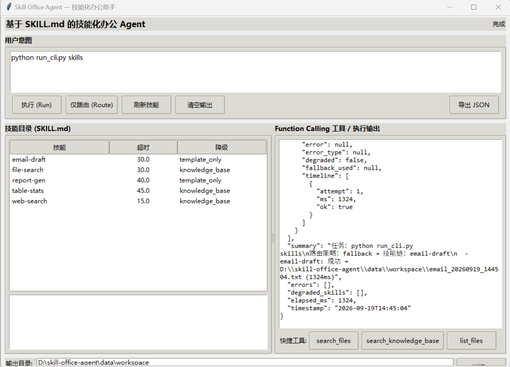
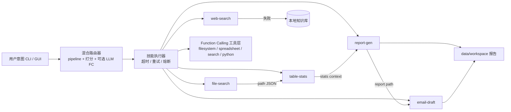

# Skill Office Agent

> 基于 **SKILL.md** 的技能化办公 Agent：把「本地办公任务」做成可插拔技能包，自动路由意图、串行调用多技能、通过 Function Calling 执行工具，并在超时/失败时降级，保证流水线不中断。

**为什么做这个项目？**  
通用 Agent Demo 往往「能聊天、难落地」：技能写死在代码里、失败直接抛错、多步任务无法串联。本项目用 **SKILL.md 做技能契约**，用 **混合路由 + 数据透传** 把「找文件 → 统计 → 写报告 → 起草邮件」跑成一条可验证链路，并预留 **OpenAI 兼容 Function Calling** 接入点（规则优先、模型可插拔）。

| 一句话定位 | 亮点 |
|-----------|------|
| 可扩展的本地办公技能 Agent | 5 个办公技能 · CLI + Tkinter GUI · 多技能串行 · 三级容错 · FC 工具层 · 离线可用 |

仓库：`https://github.com/moli-lihuashi/skill-office-agent`

---

## 核心亮点

### 1. 渐进式技能模型（SKILL.md as Contract）

技能不是 if-else 分支，而是「目录 + 契约」：

```
skills/table-stats/
├── SKILL.md          # frontmatter：何时触发/关键词/工具/超时/降级；正文：执行步骤
└── scripts/run.py    # 子进程入口：stdin JSON → stdout JSON
```

- **常驻上下文只读 frontmatter**（路由用），执行时才加载正文与脚本 → 控制上下文膨胀  
- **新技能 = 新目录**，不改核心编排代码  
- 参数与结果统一 JSON，便于串联与日志回放  

### 2. 三级容错（本项目最核心的工程设计）

| 层级 | 机制 | 效果 |
|------|------|------|
| L1 执行层 | 子进程超时 + 指数退避重试 | 单技能抖动不拖垮整条链 |
| L2 降级层 | 技能级 `fallback`：`knowledge_base` / `template_only` | 网络失败仍返回结构化结果 |
| L3 保护层 | 熔断器（连续失败打开，冷却后恢复） | 避免故障技能雪崩 |

实例：`web-search` 超时后 **不再空等重试**，立即切 `knowledge/office_kb.json`，结果标记 `degraded=true`，下游报告/邮件继续生成。

### 3. 多技能串行 + 数据透传

路由识别复合意图后按序执行；前序 `JSON` 自动注入后序参数：

```text
用户：找到销售表并统计各区域销售额，生成报告并起草同步邮件
路由：pipeline = search_stats_report_email
链路：file-search → table-stats → report-gen → email-draft
透传：命中路径 → 统计入参 → context → 报告/邮件正文
```

### 4. 混合智能路由（规则 / LLM 可插拔）

优先级：**显式技能名 → 流水线规则 →（可选）LLM FC 选技能 → 关键词+描述打分 → 兜底**  

执行模式 `config.agent.mode` / CLI `--mode`：

| mode | 行为 |
|------|------|
| `rule` | 纯规则技能链 |
| `llm_agent` | 模型 Function Calling 自主调工具；失败自动回落 rule |
| `hybrid`（默认） | 规则串技能；配置 LLM 后报告/邮件可模型润色，失败回模板 |

未配置 API Key 时 **完全离线可跑**，适合本地演示与 CI。

### 5. Function Calling 工具层 + 双端形态

- 11 个工具（文件检索/表格统计/搜索/写文件/跑 Python…），OpenAI 风格 schema + 本地 `dispatch_tool`  
- **CLI** 便于自动化与测试；**Tkinter 桌面 GUI** 便于演示技能目录、路由结果、执行日志与降级状态  

---

## 桌面 GUI（可视化演示）

```powershell
python run_desktop.py
```



界面能力：

- 左侧：SKILL.md 技能目录（名称 / 超时 / 降级策略），点击查看详情  
- 右侧：执行输出与 Function Calling 快捷调用  
- 顶部：意图输入 +「执行 / 仅路由 / 刷新技能 / 导出 JSON」  
- 状态栏：技能数量、当前 `mode`、LLM 路由是否开启  

---

## 快速开始

### 环境

- Python 3.10+（开发验证：3.12）  
- 依赖：`pandas`、`openpyxl`（表格技能）；其余为标准库  

```powershell
git clone https://github.com/moli-lihuashi/skill-office-agent.git
cd skill-office-agent
# 可选：pip install pandas openpyxl
```

### 30 秒跑通第一个任务

```powershell
# 1. 看技能
python run_cli.py skills

# 2. 只看路由（不执行）
python run_cli.py route "找到销售表并统计各区域销售额，生成报告并起草同步邮件"

# 3. 端到端执行（相对路径，仓库根目录下运行）
python run_cli.py run "找到销售表并统计各区域销售额，生成报告并起草同步邮件" `
  --args-file data/workspace/demo_args.json --mode hybrid
```

产物：

- 报告：`data/workspace/report_*.md`  
- 邮件：`data/workspace/email_*.txt`  
- 会话日志：`logs/session_*.json`  

一键演示：

```powershell
powershell -File examples/run_demo.ps1
```

桌面端：`python run_desktop.py`

### 常用命令

| 命令 | 作用 |
|------|------|
| `run_cli.py skills` | 列出技能与降级策略 |
| `run_cli.py tools` | 列出 FC 工具 |
| `run_cli.py route "<意图>"` | 仅路由 |
| `run_cli.py run "<意图>" --mode rule\|llm_agent\|hybrid` | 执行 |
| `run_cli.py run ... --args-file <json>` | 传参（避免 shell 引号问题） |
| `run_cli.py call-tool <name> --args-file <json>` | 直接调工具 |

可选 LLM（OpenAI 兼容）：`config.json` → `llm.base_url` / `api_key` / `model`，或环境变量 `LLM_BASE_URL` / `LLM_API_KEY` / `LLM_MODEL` / `SKILL_AGENT_MODE`。

---

## 真实运行效果（节选）

### 执行摘要

```text
任务：找到销售表并统计各区域销售额，生成报告并起草同步邮件
路由策略：pipeline → 技能链：file-search → table-stats → report-gen → email-draft

  - file-search: 成功 count=1
      → data/samples/sales_2024.csv
  - table-stats: 成功 rows=10
      分组 region → sales (sum)：
        华东: 1020000 | 华南: 885000 | 华北: 804000 | 西南: 303000
  - report-gen: 成功 → data/workspace/report_*.md
  - email-draft: 成功 → data/workspace/email_*.txt
```

### 生成邮件样例

```text
收件人：项目组
主题：销售数据同步

尊敬的项目组：
您好！
1. 相关文件 1 个已定位
2. 数据文件：data/samples/sales_2024.csv，规模 10×5
3. sales：均值 301200.0，范围 [120000.0, 540000.0]
4. 分组结果（region）：华东=1020000，华南=885000，华北=804000
5. 详细报告见：data/workspace/report_*.md
```

### 网络失败降级（容错）

```text
[skill-fail] web-search attempt=1 err=timeout after 15.0s
[fallback-early] web-search timeout → knowledge_base
web-search: 成功（降级） degraded=true fallback=knowledge_base
→ 仍返回本地知识库条目，下游流程不断
```

### llm_agent 无 Key 回落

```text
mode=llm_agent
[llm_agent-fallback] llm_not_configured; use rule pipeline
table-stats: 成功（region→sales 分组正常）
LLM: {"mode":"llm_agent","fallback_to":"rule","error":"llm_not_configured"}
```

完整 JSON 样例见 [`docs/sample_run_output.json`](docs/sample_run_output.json)。

---

## 系统架构



```text
skill-office-agent/
├── run_cli.py / run_desktop.py   # CLI 与桌面入口
├── agent/                        # 注册表 / 路由 / 执行器 / LLM / 编排
├── skills/*/SKILL.md             # 技能契约 + scripts/run.py
├── tools/                        # FC 工具与表格/搜索/文档能力
├── knowledge/office_kb.json      # 降级知识库
├── templates/                    # 报告与邮件模板
├── data/samples/                 # 示例 CSV / Excel
├── data/workspace/               # 输出目录（演示参数 JSON）
├── skill.png                 # 桌面 GUI 截图
├── docs/                     # 示例执行输出等
└── tests/test_agent.py       # 端到端测试
```

---

## 内置技能

| 技能 | 职责 | 典型触发 | fallback |
|------|------|----------|----------|
| `file-search` | 本地文件检索 | 找文件 / 查找 Excel | knowledge_base |
| `table-stats` | CSV/Excel 统计分组 | 统计 / 按列汇总 | knowledge_base |
| `report-gen` | Markdown 报告 | 写报告 / 生成总结 | template_only |
| `web-search` | 网络信息（可降级） | 搜索一下 / 调研 | knowledge_base |
| `email-draft` | 邮件草稿 | 写邮件 / 通知 | template_only |

---

## 扩展方式

1. 新建 `skills/<kebab-name>/SKILL.md`（description 写清 WHAT + WHEN + 口头触发词）+ `scripts/run.py`  
2. 新工具：实现函数 → 加入 `tools/__init__.py` 的 schema 与 `dispatch_tool`  
3. 新串行组合：在 `agent/router.py` 的 `PIPELINES` 增加正则与技能链  
4. 回归：`python -m unittest tests.test_agent -v`  

```powershell
python -m unittest tests.test_agent -v
# Ran 26 tests ... OK
```

---

## 设计取舍（可讨论点）

| 决策 | 理由 |
|------|------|
| 技能脚本子进程隔离 | 超时可杀、崩溃不拖垮 Agent；stdin/stdout JSON 契约清晰 |
| 规则优先、LLM 可插拔 | 求职演示/内网/无 Key 环境可运行；配置后同一套 FC schema 升级为模型自主调用 |
| 降级返回结构化 JSON 而非抛异常 | 多步办公链更需要「可继续」而不是「报错终止」 |
| frontmatter 体积刻意做小 | 路由只依赖触发元数据，符合渐进披露 |

---

## License

MIT（可按需修改）
